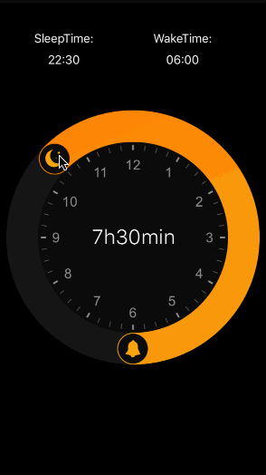
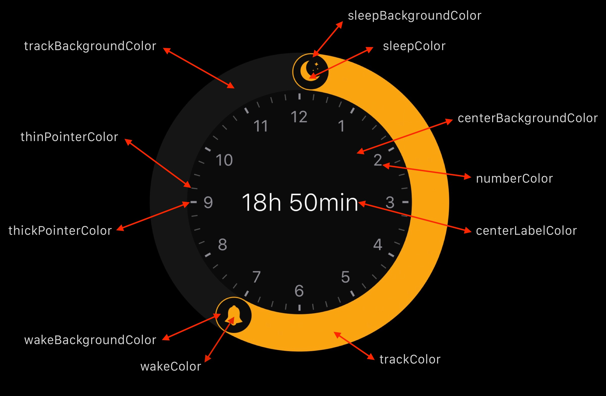

## NKBedtimeClock

An Objective-C version copy from  [LeonardoCardoso](https://github.com/LeonardoCardoso/BedtimeClock)
I just add 24-hours calculate part.
This is a view like the clock of bedtime that can set sleep time, wake time and sleep duration time.



### Init

```Objective-C
// Time jumps at each five minutes
int sleepTime = 1320; // Hour: 22:00
int wakeTime = 360;   // Hour: 06:00
NKBedtimeClock *bedtimeClock = [[NKBedtimeClock alloc] initWithFrame:CGRectMake(0, 0, self.view.frame.size.width, self.view.frame.size.width) sleepTimeInMinutes:sleepTime wakeTimeInMinutes:wakeTime];
bedtimeClock.delegate = self;
[contentView addSubview:bedtimeClock];
```

### delegate

Watch the changes using this snippet:

```Objective-C
- (void)NKBedtimeClock:(NKBedtimeClock *)bedtimeClock didUpdateSleepTime:(NSString *)sleepTime wakeTime:(NSString *)wakeTime sleepDuration:(NSString *)sleepDuration{

NSLog(@"sleepTime:%@, wakeTime:%@, sleepDuration:%@", sleepTime, wakeTime, sleepDuration);
}
```

### Palette

You can change the colors whenever you want. Let's say if you want to give an impression of enabling and disabling the clock. To do so, use this function:

```Objective-C
// Change nil for the color of your choice
self.bedtimeClock.trackBackgroundColor = nil
...
also{
trackBackgroundColor = nil,
centerBackgroundColor = nil,
wakeBackgroundColor = nil,
wakeColor = nil,
sleepBackgroundColor = nil,
sleepColor = nil,
trackColor = nil,
numberColor = nil,
thickPointerColor = nil,
thinPointerColor = nil,
centerLabelColor = nil
}
```
See below the full color reference:



## License

BedtimeClock is released under the MIT license. See [LICENSE](https://github.com/leocardz.com/BedtimeClock/blob/master/LICENSE) for details.
